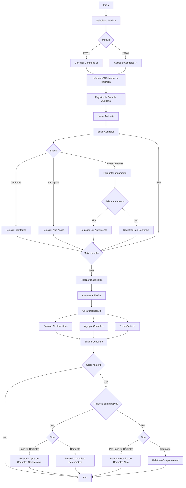

<br clear="left">
<br>
&nbsp;

# Diagnóstico de Conformidade ISO/IEC 27001 e 27701

Ferramenta web Streamlit** desenvolvida em python como entrega do Projeto de Segurança I (PSI).

> **Docente:** Mehran Misaghi.

> **Discentes:** Gabriel Gomes Galikosky, Ricardo André da Silva e Paulo José de Oliveira Rolinski.

A aplicação auxilia auditores no diagnóstico de conformidade nas normas ISO/IEC 27001 (operacionalizada pelos controles da ISO/IEC 27002) e ISO/IEC 27701 (extensão de privacidade, com mapeamento à LGPD). Para cada controle o auditor responde Conforme / Não Conforme / N/A; controles não-conformes podem registrar remediação em andamento com responsável, prazo e observações. Os resultados são persistidos em SQLite local e consolidados em dashboard, plano de ação e relatórios PDF/CSV, com comparativo histórico entre as últimas auditorias.

## 1. Descrição do sistema

Aplicação Python/Streamlit, arquitetura modular, persistência local em SQLite. Suporta múltiplas organizações e múltiplos diagnósticos por módulo.

### Funcionalidades

- Dois módulos independentes: ISO/IEC 27001 (avaliada pelos 93 controles da 27002) e ISO/IEC 27701.
- Cadastro da organização auditada e data da auditoria.
- Avaliação controle a controle com Conforme, Não Conforme, N/A e pergunta condicional de trabalho em andamento (remediação) quando não-conforme.
- Atribuição de criticidade (Alta / Média / Baixa), responsável e prazo.
- Score ponderado por criticidade, com agregação por tema (27002) ou categoria (27701).
- Dashboard com indicadores e gráficos interativos (Plotly).
- Snapshots históricos para comparar a auditoria atual com até as 3 anteriores.
- Plano de ação priorizado (export CSV) e relatório PDF completo (ReportLab).

### Estrutura do código

```text
.
├─ app.py                     # Entrypoint Streamlit; tabela de rotas.
├─ core/
│  ├─ state.py                 # Estado da sessão e persistência por módulo.
│  ├─ db.py                    # Acesso SQLite (diagnósticos, avaliações, snapshots, controles).
│  ├─ models.py                # Dataclass Avaliacao e constantes de domínio.
│  ├─ scoring.py               # Cálculo de score, agregação por tema e ResultadoTema.
│  ├─ action_plan.py           # Geração e export do plano de ação.
│  ├─ pdf_report.py            # Relatórios PDF.
│  └─ pdf_charts.py            # Gráficos do PDF.
├─ modulos/
│  ├─ iso27002/                # Controles, temas e guidance da 27002.
│  └─ iso27701/                # Controles e categorias da 27701 com mapeamento LGPD.
├─ views/                      # Telas: home, diagnósticos, assessment, dashboard, action_plan, history.
└─ components/                 # Componentes visuais reutilizáveis (cards, gauge, métricas, sumário de tema).
```

### Persistência

Banco SQLite criado automaticamente em `diagnosticos.db` na raiz do projeto. Variável `DIAGNOSTICO_DB_PATH` permite redirecionar para outro caminho. Tabelas principais: `diagnostico`, `avaliacao`, `snapshot`, `iso27002_tema`, `iso27002_controle`, `iso27701_categoria`, `iso27701_controle`.

### Requisitos

#### Funcionais (RF)

| ID | Descrição |
| --- | --- |
| **RF01** | O auditor escolhe entre dois módulos no início: ISO/IEC 27001 (avaliada pelos controles da 27002) ou ISO/IEC 27701. |
| **RF02** | Cada diagnóstico identifica a organização auditada e a data em que a auditoria foi realizada. |
| **RF03** | Diagnósticos antigos podem ser reabertos, editados ou excluídos a qualquer momento. |
| **RF04** | Cada controle recebe um status entre Conforme, Parcial, Não Conforme ou N/A. |
| **RF05** | Quando o controle não está conforme, o auditor informa se há remediação em andamento e registra responsável, prazo e observação. |
| **RF06** | Cada controle tem uma criticidade associada — Alta, Média ou Baixa — que pondera o cálculo do score. |
| **RF07** | O sistema calcula o score geral e o score por tema/categoria com base nas avaliações registradas. |
| **RF08** | O dashboard reúne os indicadores com gráficos de status (donut), categorias (barras), comparativo entre temas (radar) e medidor geral. |
| **RF09** | A qualquer momento o auditor pode salvar um snapshot da auditoria, congelando os scores do dia. |
| **RF10** | É possível comparar dois snapshots lado a lado, ver a evolução por categoria e identificar o que melhorou ou piorou. |
| **RF11** | A partir das avaliações o sistema gera um plano de ação priorizado, com opção de exportar em CSV. |
| **RF12** | O relatório em PDF pode ser gerado da auditoria atual ou comparando snapshots anteriores. |

#### Não-funcionais (RNF)

| ID | Descrição |
| --- | --- |
| **RNF01** | Roda localmente como aplicação Streamlit, acessada por qualquer navegador moderno. |
| **RNF02** | Requer Python 3.11 ou superior; as dependências estão fixadas em [requirements.txt](requirements.txt) e [requirements-dev.txt](requirements-dev.txt). |
| **RNF03** | Os dados ficam em um banco SQLite local, sem necessidade de servidor; o caminho do arquivo pode ser trocado pela variável `DIAGNOSTICO_DB_PATH`. |
| **RNF04** | O schema é criado com `CREATE TABLE IF NOT EXISTS` e as migrações preservam dados já existentes (ver `_migrar` em [core/db.py](core/db.py)). |
| **RNF05** | As chaves estrangeiras ficam ativas via `PRAGMA foreign_keys = ON`, com `ON DELETE CASCADE` ligando diagnóstico, avaliações e snapshots. |
| **RNF06** | Todas as queries usam parâmetros posicionais, evitando concatenação de strings e SQL injection. |
| **RNF07** | O código é tipado e validado por mypy em modo estrito; o Ruff cuida do lint e da ordenação de imports. |
| **RNF08** | Os testes em pytest rodam contra um banco temporário, sem interferir no `diagnosticos.db` real. |
| **RNF09** | A pipeline do GitHub Actions executa lint, type-check e testes a cada push e pull request na main. |
| **RNF10** | Toda a interface é em português brasileiro, mantendo a acentuação e a nomenclatura oficial das normas ISO. |

### Regras de negócio

| ID | Regra |
| --- | --- |
| **RN01** | Os status reconhecidos são Conforme, Parcial, Não Conforme e N/A. Um controle sem resposta entra como "Não avaliado" e não influencia o score. |
| **RN02** | Para o cálculo, Conforme vale 100, Parcial vale 50 e Não Conforme vale 0. Itens N/A e Não avaliado ficam fora da conta, tanto no numerador quanto no denominador. Ver [core/scoring.py](core/scoring.py). |
| **RN03** | Os pesos por criticidade são Alta = 3,0 · Média = 2,0 · Baixa = 1,0. Quando o auditor não informa, assume-se Média ([core/models.py](core/models.py)). |
| **RN04** | O score de um tema (27002) ou de uma categoria (27701) é a média ponderada dos status pelos pesos de criticidade dos controles ali avaliados. |
| **RN05** | O score geral aplica a mesma fórmula ao conjunto completo de controles do módulo. |
| **RN06** | A faixa de classificação usada nos rótulos: score ≥ 80 indica Conforme, entre 40 e 80 indica Parcial e abaixo de 40 indica Não Conforme (`status_label` em [core/scoring.py](core/scoring.py)). |
| **RN07** | O plano de ação ([core/action_plan.py](core/action_plan.py)) traz só os controles em situação Não Conforme ou Parcial. Conforme e N/A não viram tarefa. |
| **RN08** | A prioridade no plano combina status e criticidade: Não Conforme + Alta vira Crítica; Não Conforme + Média/Baixa vira Alta; Parcial + Alta vira Alta; Parcial + Média/Baixa vira Média; o restante fica como Baixa. |
| **RN09** | A ordenação do plano segue, nessa ordem: gravidade do status (Não Conforme antes de Parcial), depois criticidade (Alta → Média → Baixa) e, por desempate, o identificador do controle. |
| **RN10** | Se o auditor não informar a data da auditoria, o sistema assume a data atual no momento em que o diagnóstico é criado (`criar_diagnostico` em [core/db.py](core/db.py)). |
| **RN11** | O campo `atualizado_em` do diagnóstico é refrescado a cada `salvar_avaliacoes`, o que permite ordenar a lista pelos mais recentes. |
| **RN12** | Cada snapshot guarda o score geral, os scores por categoria e o total de itens avaliados na hora em que foi salvo — servindo como ponto fixo no tempo para comparativos. |
| **RN13** | Na comparação entre snapshots ([views/history.py](views/history.py)), uma variação maior que +0,5 pp marca a categoria como melhorou; menor que −0,5 pp como piorou; entre os dois extremos, fica como estável. |
| **RN14** | Quando um diagnóstico é excluído, todas as suas avaliações e snapshots são removidos junto, por efeito do `ON DELETE CASCADE`. |
| **RN15** | As evidências de cada controle são guardadas como JSON na coluna `evidencias` da tabela `avaliacao`. |

---

## 2. Diagramas

### 2.1 Fluxograma do processo de auditoria



### 2.2 Diagrama de casos de uso

<p align="center">
    
</p>

### 2.3 Diagrama de classes (UML)

<p align="center">
    
</p>


## Como executar

Pré-requisitos: Python 3.11+ e `pip`.

```powershell
# 1. Criar e ativar o ambiente virtual
python -m venv .venv
.\.venv\Scripts\Activate.ps1

# 2. Instalar dependências
pip install -r requirements.txt

# 3. Executar a aplicação Streamlit
streamlit run app.py
```

O banco `diagnosticos.db` é criado automaticamente na primeira execução. Para usar outro caminho, defina a variável de ambiente `DIAGNOSTICO_DB_PATH`.

### Dependências principais ([requirements.txt](requirements.txt))

- `streamlit`: interface web
- `plotly`: gráficos interativos do dashboard
- `pandas`: manipulação tabular
- `reportlab`: geração dos relatórios PDF

Dependências de desenvolvimento (lint, testes, type-check) em [requirements-dev.txt](requirements-dev.txt).
