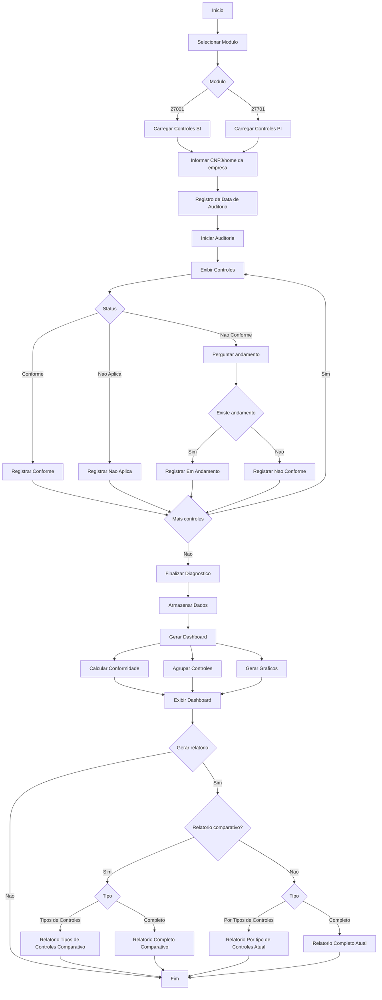
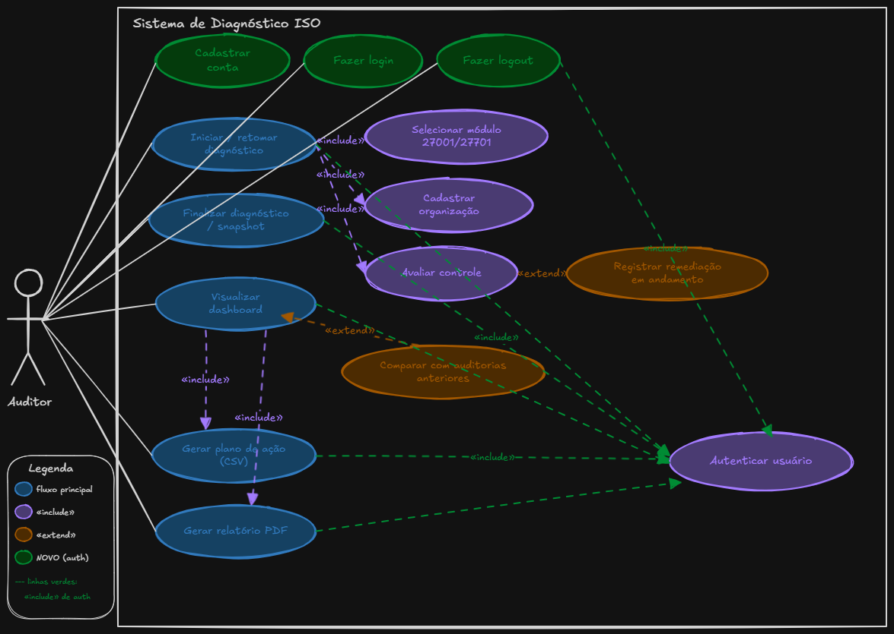
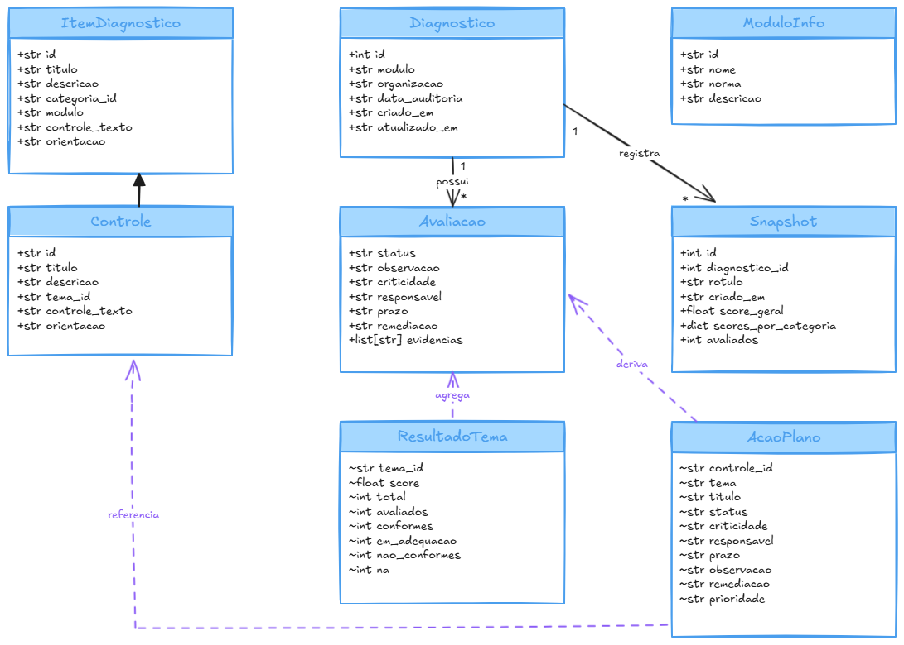

<br clear="left">
<br>
&nbsp;

# Diagnóstico de Conformidade ISO/IEC 27001 e 27701

Ferramenta web Streamlit desenvolvida em Python como entrega do Projeto de Segurança I (PSI).

> **Docente:** Mehran Misaghi.

> **Discentes:** Gabriel Gomes Galikosky, Ricardo André da Silva e Paulo José de Oliveira Rolinski.

A aplicação auxilia auditores no diagnóstico de conformidade nas normas ISO/IEC 27001 (operacionalizada pelo questionário dos 93 controles da ISO/IEC 27002:2022) e ISO/IEC 27701 (extensão de privacidade, com referências à LGPD). Para cada controle o auditor responde Conforme / Não Conforme / N/A; controles Não Conformes podem registrar remediação em andamento, com responsável, prazo e observação. Os resultados são persistidos em SQLite local e consolidados em dashboard, plano de ação e relatórios PDF/CSV, com comparativo histórico entre snapshots de auditoria.

## 1. Descrição do sistema

Aplicação Python/Streamlit, arquitetura modular, persistência local em SQLite. Suporta múltiplas organizações e múltiplos diagnósticos por módulo.

### Funcionalidades

- Dois módulos independentes: **ISO/IEC 27001** (questionário operacionalizado pelos 93 controles da ISO/IEC 27002:2022) e **ISO/IEC 27701** (78 controles dos Anexos A, B e segurança aplicada a DP, com referências à LGPD).
- Cadastro da organização auditada e data da auditoria.
- Avaliação controle a controle com Conforme, Não Conforme, N/A e pergunta condicional de remediação em andamento (Sim/Não) quando o status é Não Conforme.
- Atribuição de criticidade (Alta / Média / Baixa), responsável, prazo (date picker) e observações.
- Score ponderado por criticidade, com agregação por tema (27001) ou categoria (27701).
- Dashboard com indicadores e gráficos interativos (Plotly): medidor de score geral, radar comparativo entre temas/categorias, barras por tema/categoria e cards de distribuição de status.
- Snapshots históricos da auditoria, com tabela cronológica e comparação A vs B entre quaisquer dois snapshots.
- Plano de ação priorizado por gravidade e criticidade (export CSV) e relatórios PDF completo e comparativo (ReportLab).
- Catálogo de controles persistido no banco e seed automático a partir dos JSONs em `data/` no primeiro `init_db()`.
- Seed opcional de diagnóstico demo (controlável pela variável `DIAGNOSTICO_SEED_DEMO`).
- Trilha de auditoria das ações realizadas no próprio sistema (criação/edição/exclusão de diagnósticos, salvamento de avaliações, snapshots), com tela dedicada de consulta. Atende ao controle 8.15 (Logging) da ABNT NBR ISO/IEC 27001:2022.
- Autenticação multi-usuário com email/senha local (hash bcrypt) e cookie persistente de 30 dias via [streamlit-authenticator](https://github.com/mkhorasani/Streamlit-Authenticator). Cadastro aberto, com gravação direta no SQLite. Pode ser desabilitada em desenvolvimento via `DIAGNOSTICO_AUTH=off`.

### Estrutura do código

```text
.
├─ app.py                     # Entrypoint Streamlit; gate de auth e tabela de rotas.
├─ core/
│  ├─ state.py                 # Estado da sessão e persistência por módulo.
│  ├─ db.py                    # Acesso SQLite (diagnósticos, avaliações, snapshots, usuários, catálogos).
│  ├─ auth.py                  # Autenticação multi-usuário (streamlit-authenticator + SQLite).
│  ├─ audit.py                 # Trilha de auditoria (registrar/listar eventos).
│  ├─ models.py                # Dataclass Avaliacao e constantes de domínio.
│  ├─ types.py                 # Tipos compartilhados (ItemDiagnostico, ModuloInfo).
│  ├─ scoring.py               # Cálculo de score, agregação por tema e ResultadoTema.
│  ├─ action_plan.py           # Geração e export do plano de ação.
│  ├─ export.py                # Export CSV de avaliações.
│  ├─ pdf_report.py            # Relatórios PDF (atual e comparativo).
│  └─ pdf_charts.py            # Gráficos vetoriais usados no PDF (donut, radar, barras).
├─ modulos/
│  ├─ iso27001/                # Catálogo da 27001 (controles agrupados pelos temas da 27002).
│  └─ iso27701/                # Catálogo da 27701 (controles e categorias) e telas próprias.
├─ views/                      # Telas: home, login, diagnósticos, assessment, dashboard, action_plan, history, audit_log.
├─ components/                 # Componentes visuais reutilizáveis (cards, gauge, métricas, sumário de tema).
└─ data/                       # Catálogos JSON e diagnóstico demo.
```

### Persistência

Banco SQLite criado automaticamente em `diagnosticos.db` na raiz do projeto. A variável `DIAGNOSTICO_DB_PATH` permite redirecionar para outro caminho (útil em testes). Tabelas:

- `diagnostico` — uma linha por auditoria (modulo, organização, data, timestamps, `usuario_email` opcional do dono).
- `avaliacao` — avaliações por (diagnóstico, controle), com chave estrangeira em cascata.
- `snapshot` — fotografia do score geral e por tema/categoria em um instante.
- `iso27001_tema`, `iso27001_controle` — catálogo da 27001.
- `iso27701_categoria`, `iso27701_controle` — catálogo da 27701.
- `usuario` — contas de auditor (email, nome, senha bcrypt, criado_em, ativo). Populada por cadastro aberto na tela de login.
- `audit_log` — trilha de auditoria das ações relevantes (criação/edição/exclusão de diagnósticos, snapshots e avaliações), com `quando` (ISO 8601), `usuario_email` (do logado), `acao`, `alvo_tipo`, `alvo_id` e `detalhes` em JSON.

### Requisitos

#### Funcionais (RF)

| ID | Descrição |
| --- | --- |
| **RF01** | O auditor escolhe entre dois módulos no início: ISO/IEC 27001 (questionário da ISO/IEC 27002) ou ISO/IEC 27701. |
| **RF02** | Cada diagnóstico identifica a organização auditada e a data em que a auditoria foi realizada. |
| **RF03** | Diagnósticos antigos podem ser reabertos, editados ou excluídos a qualquer momento. |
| **RF04** | Cada controle recebe um status entre Conforme, Não Conforme ou N/A. |
| **RF05** | Quando o controle é Não Conforme, o auditor informa se há remediação em andamento (Sim/Não) e registra responsável, prazo e observação. |
| **RF06** | Cada controle tem uma criticidade associada - Alta, Média ou Baixa - que pondera o cálculo do score. |
| **RF07** | O sistema calcula o score geral e o score por tema (27001) / categoria (27701) com base nas avaliações registradas. |
| **RF08** | O dashboard reúne os indicadores com gráficos interativos: medidor de score geral, radar comparativo entre temas/categorias, barras por tema/categoria e cards de distribuição de status. |
| **RF09** | A qualquer momento o auditor pode salvar um snapshot da auditoria, congelando os scores do dia. |
| **RF10** | É possível comparar dois snapshots lado a lado, ver a evolução por categoria e identificar o que melhorou ou piorou. |
| **RF11** | A partir das avaliações o sistema gera um plano de ação priorizado, com opção de exportar em CSV. |
| **RF12** | O relatório em PDF pode ser gerado da auditoria atual ou comparando dois snapshots anteriores. |
| **RF13** | O sistema mantém uma trilha de auditoria das ações relevantes (criação/edição/exclusão de diagnósticos, salvamento de avaliações e snapshots) com data/hora, ação, alvo e detalhes. Uma tela dedicada permite consultar o histórico com filtros por ação e período. |
| **RF14** | A aplicação exige autenticação por email e senha local antes de qualquer operação. Cadastro é aberto na tela de login e cada usuário só vê seus próprios diagnósticos. |

#### Não-funcionais (RNF)

| ID | Descrição |
| --- | --- |
| **RNF01** | Roda localmente como aplicação Streamlit, acessada por qualquer navegador. |
| **RNF02** | Requer Python 3.11 ou superior; as dependências estão fixadas em [requirements.txt](requirements.txt) e [requirements-dev.txt](requirements-dev.txt). |
| **RNF03** | Os dados ficam em um banco SQLite local, sem ter s necessidade de servidor; o caminho do arquivo pode ser trocado pela variável `DIAGNOSTICO_DB_PATH`. |
| **RNF04** | O schema é criado com `CREATE TABLE IF NOT EXISTS` e os catálogos são populados por seed idempotente a partir dos JSONs em `data/` (ver `_seed_catalogo` em [core/db.py](core/db.py)). |
| **RNF05** | As chaves estrangeiras ficam ativas via `PRAGMA foreign_keys = ON`, com `ON DELETE CASCADE` ligando diagnóstico, avaliações e snapshots. |
| **RNF06** | Todas as queries usam parâmetros posicionais, evitando concatenação de strings e SQL injection. |
| **RNF07** | O código é tipado e validado por mypy em modo estrito; o Ruff cuida do lint e da ordenação de imports. |
| **RNF08** | Os testes em pytest rodam contra um banco temporário, sem interferir no `diagnosticos.db` real. |
| **RNF09** | A pipeline do GitHub Actions executa lint, type-check e testes a cada push e pull request na main. |
| **RNF10** | Toda a interface é em pt-br, mantendo a acentuação e a nomenclatura oficial das normas ISO. |
| **RNF11** | Senhas de usuário são armazenadas com hash bcrypt (cost padrão da `streamlit-authenticator`); a sessão é mantida por cookie assinado HMAC com expiração de 30 dias. |

### Regras de negócio

| ID | Regra |
| --- | --- |
| **RN01** | Os status reconhecidos são Conforme, Não Conforme e N/A. Um controle sem resposta entra como "Não avaliado" e não influencia o score. |
| **RN02** | Para o cálculo: Conforme vale 100, Não Conforme com remediação em andamento vale 50, Não Conforme sem remediação vale 0. Itens N/A e Não avaliado ficam fora da conta, tanto no numerador quanto no denominador. Ver [core/scoring.py](core/scoring.py). |
| **RN03** | Os pesos por criticidade são Alta = 3,0 · Média = 2,0 · Baixa = 1,0. Quando o auditor não informa, assume-se Média ([core/models.py](core/models.py)). |
| **RN04** | O score de um tema (27001) ou de uma categoria (27701) é a média ponderada das pontuações pelos pesos de criticidade dos controles ali avaliados. |
| **RN05** | O score geral aplica a mesma fórmula ao conjunto completo de controles do módulo. |
| **RN06** | A faixa de classificação usada nos rótulos: score ≥ 80 indica Conforme, entre 40 e 80 indica "Em Adequação" e abaixo de 40 indica Não Conforme (`status_label` em [core/scoring.py](core/scoring.py)). "Em Adequação" também é o rótulo individual para controles Não Conformes que possuem remediação em andamento. |
| **RN07** | O plano de ação ([core/action_plan.py](core/action_plan.py)) traz só os controles em situação Não Conforme. Conforme e N/A não viram tarefa. |
| **RN08** | A prioridade no plano combina status, criticidade e remediação: Não Conforme + Alta sem remediação vira Crítica; Não Conforme + Média/Baixa sem remediação vira Alta; Não Conforme + Alta com remediação em andamento vira Alta; Não Conforme + Média/Baixa com remediação vira Média. |
| **RN09** | A ordenação do plano segue, nessa ordem: prioridade (Crítica → Alta → Média → Baixa), depois criticidade (Alta → Média → Baixa) e, por desempate, o identificador do controle. |
| **RN10** | Se o auditor não informar a data da auditoria, o sistema assume a data atual no momento em que o diagnóstico é criado (`criar_diagnostico` em [core/db.py](core/db.py)). |
| **RN11** | O campo `atualizado_em` do diagnóstico é refrescado a cada `salvar_avaliacoes`, o que permite ordenar a lista pelos mais recentes. |
| **RN12** | Cada snapshot guarda o score geral, os scores por tema/categoria e o total de itens avaliados na hora em que foi salvo - servindo como ponto fixo no tempo para comparativos. |
| **RN13** | Na comparação entre snapshots ([views/history.py](views/history.py)), uma variação maior que +0,5 pp marca a categoria como melhorou; menor que -0,5 pp como piorou; entre os dois extremos, fica como estável. |
| **RN14** | Quando um diagnóstico é excluído, todas as suas avaliações e snapshots são removidos junto, por efeito do `ON DELETE CASCADE`. |
| **RN15** | As evidências de cada controle são guardadas como JSON na coluna `evidencias` da tabela `avaliacao`. |
| **RN16** | A trilha de auditoria registra cada ação relevante na tabela `audit_log` ([core/audit.py](core/audit.py)). Falhas no registro de eventos não interrompem a operação principal: são apenas reportadas no logger Python `audit` para o operador, garantindo que nenhuma avaliação ou snapshot deixe de ser persistido por causa de um problema de log. |

---

## 2. Diagramas

### 2.1 Fluxograma do processo de auditoria



### 2.2 Diagrama de casos de uso

<p align="center">
    
</p>

### 2.3 Diagrama de classes (UML)

<p align="center">
    
</p>


## Como executar

### Local (via Python)

Pré-requisitos: Python 3.11+ e `pip`.

```powershell
# 1. Criar e ativar o ambiente virtual
python -m venv .venv
.\.venv\Scripts\Activate.ps1

# 2. Instalar dependências
pip install -r requirements.txt

# 3. Executar a aplicação Streamlit
streamlit run app.py
```

O banco `diagnosticos.db` é criado automaticamente na primeira execução. Para usar outro caminho, defina a variável de ambiente `DIAGNOSTICO_DB_PATH`. Para desabilitar o seed do diagnóstico demo em DB vazio, defina `DIAGNOSTICO_SEED_DEMO=0`.

### Autenticação

A aplicação exige login por email e senha antes de mostrar qualquer tela. Na primeira execução, vá até a aba **Cadastrar** da tela de login e crie sua conta - o usuário é gravado direto no SQLite com senha hash bcrypt. A sessão fica ativa por 30 dias via cookie assinado.

Para o cookie funcionar, configure o segredo de assinatura em `.streamlit/secrets.toml` (não comite o arquivo):

```toml
[auth]
cookie_secret = "uma-string-aleatoria-longa"
```

Gere um valor com:

```bash
python -c "import secrets; print(secrets.token_urlsafe(32))"
```

Em desenvolvimento e em CI, é possível desligar a autenticação completamente:

```bash
DIAGNOSTICO_AUTH=off streamlit run app.py
```

Nesse modo o sistema usa um usuário fictício `dev@local` para preencher o `usuario_email` no banco e na trilha de auditoria, e a tela de login não é renderizada.

### Docker

Pré-requisitos: Docker 20+ e Docker Compose (já incluso no Docker Desktop).

```bash
docker compose up --build
```

A aplicação fica disponível em <http://localhost:8501>. O banco é persistido em `./data-db/diagnosticos.db` no host (criado automaticamente). Parar com `Ctrl+C` ou `docker compose down`.

Para desabilitar o seed do diagnóstico demo, descomente a variável `DIAGNOSTICO_SEED_DEMO` em `docker-compose.yml`.

### Dependências principais ([requirements.txt](requirements.txt))

- `streamlit`: interface web
- `plotly`: gráficos interativos do dashboard
- `pandas`: manipulação tabular
- `reportlab`: geração dos relatórios PDF

Dependências de desenvolvimento (lint, testes, type-check) em [requirements-dev.txt](requirements-dev.txt).
